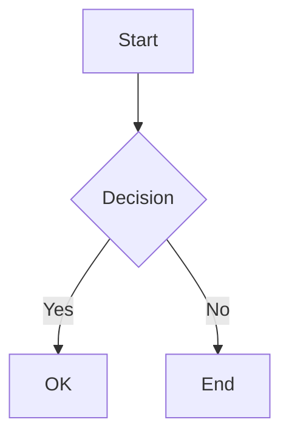

# Remar-stream | React Markdown Component for Streaming Content

[English](./README.md) | [中文](./README.zh-CN.md)

[](https://www.npmjs.com/package/remar-stream)
[](https://opensource.org/licenses/MIT)

A React Markdown renderer purpose-built for AI chat interfaces. Supports SSE streaming, KaTeX math formulas, and Mermaid diagrams. Features linear render architecture with Web Animations API for smooth, flicker-free streaming output.

## Features

- **Linear Render Architecture** — Single pipeline for both streaming and static modes. Clean architecture with no unnecessary abstraction layers.
- **Character Fade-In Animation** — Web Animations API driven, GPU-accelerated, smooth and flicker-free.
- **RC + CPS Micro-Buffering** — Adaptive jitter filtering for smooth output. No memory queue needed, zero extra latency.
- **Block Lifecycle Management** — Automatically detects when each Markdown block finishes rendering.
- **Math Formulas** — KaTeX rendering for inline (`$...$`) and block (`$$...$$`) with built-in cache.
- **Mermaid Diagrams** — Lazy-loaded (~500KB saved from main bundle), built-in zoom/download/fullscreen/source toolbar.
- **Code Highlighting** — Shiki + Web Worker for non-blocking syntax highlighting. Supports 200+ languages with built-in light/dark themes, language label and copy button on code blocks.
- **Plugin System** — Built-in registry for extending Markdown element rendering with custom components.
- **TypeScript** — Full type definitions included.

## Installation

```bash
npm install remar-stream
# or
yarn add remar-stream
# or
pnpm add remar-stream
```

**Peer dependencies** (must be installed in your project):

```bash
npm install react@^18.0.0 react-dom@^18.0.0
# or React 19
npm install react@^19.0.0 react-dom@^19.0.0
```

## Quick Start

### Static Content

```tsx
import { RemarMarkdown } from 'remar-stream';

function App() {
  return <RemarMarkdown content="# Hello, remar-stream!" />;
}
```

### SSE Streaming

```tsx
import { useState } from 'react';
import { RemarMarkdown } from 'remar-stream';

function ChatMessage() {
  const [content, setContent] = useState('');
  const [isStreaming, setIsStreaming] = useState(false);

  const sendMessage = async (message: string) => {
    setIsStreaming(true);
    setContent('');

    const response = await fetch('/api/chat', {
      method: 'POST',
      body: JSON.stringify({ message }),
    });

    const reader = response.body?.getReader();
    const decoder = new TextDecoder();

    while (reader) {
      const { done, value } = await reader.read();
      if (done) break;
      setContent(prev => prev + decoder.decode(value));
    }

    setIsStreaming(false);
  };

  return <RemarMarkdown content={content} isStreaming={isStreaming} />;
}
```

### No Animation Mode

Skip all character and block animations for maximum performance:

```tsx
<RemarMarkdown
  content={content}
  isStreaming={isStreaming}
  disableAnimation
/>
```

### Dark Theme

Switch to dark mode via the `theme` prop. The component sets `data-theme="dark"` automatically:

```tsx
<RemarMarkdown content={content} theme="dark" />
```

### Built-in Plugin Features

Mermaid, math (KaTeX), code highlighting (Shiki), and table styling are all **auto-registered on first render** — no manual setup needed. Simply use them in your Markdown:

````markdown


$$E = mc^2$$

```python
print("Hello")
```
````

> For the full plugin system guide, see [docs/plugin-system.en.md](./docs/plugin-system.en.md)

## API

### `<RemarMarkdown>`

| Prop                 | Type                             | Default      | Description                                    |
| -------------------- | -------------------------------- | ------------ | ---------------------------------------------- |
| `content`            | `string`                         | **required** | Markdown content to render                     |
| `isStreaming`        | `boolean`                        | `false`      | Whether SSE streaming is active               |
| `className`          | `string`                         | —            | Additional CSS class for the container         |
| `theme`              | `'light' \| 'dark'`              | `'light'`    | Theme mode, applied via `data-theme` attribute |
| `disableAnimation`   | `boolean`                        | `false`      | Disable character fade-in, show instantly      |
| `SimpleStreamMermaid`| `React.ComponentType<any>`       | —            | Custom Mermaid renderer component              |
| `onStatsUpdate`      | `(stats: StreamStats) => void`   | —            | Debug callback with real-time streaming metrics|

## Supported Markdown Syntax

Based on `react-markdown` + `remark-gfm`. Supports standard CommonMark and GFM extensions including headings, bold, italic, lists, links, images, code blocks, blockquotes, horizontal rules, tables, and task lists.

**Math Formulas (KaTeX)**

```
Inline: $E = mc^2$

Block:
$$
\sum_{i=1}^{n} x_i = x_1 + x_2 + \cdots + x_n
$$
```

**Mermaid Diagrams**

````markdown

````

**Code Highlighting (Shiki)**

Powered by Shiki with Web Worker for non-blocking highlighting. Supports 200+ languages out of the box with custom `remar-light`/`remar-dark` themes.

## Styling

Supports CSS variable-based theming. Dark mode works out of the box.

> For the full theming guide, see [docs/theme.en.md](./docs/theme.en.md)

## Browser Support

- Chrome >= 84
- Firefox >= 75
- Safari >= 14
- Edge >= 84

## FAQ

**How does streaming animation work?**

During streaming, characters fade in one by one. An adaptive buffering mechanism filters network jitter to ensure smooth, stable output. After streaming ends, remaining buffered content is automatically flushed — no characters are lost.

`disableAnimation` disables the fade-in effect — all characters appear instantly. Buffering still runs to keep output smooth.

**Does it work with Next.js?**

Yes. The build output includes a `"use client"` directive. Just import directly in App Router:

```tsx
import { RemarMarkdown } from 'remar-stream';
```

**Can I use it without streaming?**

Yes. Omit `isStreaming` or set it to `false` — Remar works as a standard static Markdown renderer with no extra overhead.

**Do I need to import CSS manually?**

Usually no. `dist/index.js` includes a CSS static reference that bundlers (Vite, Webpack, Next.js) handle automatically:

```tsx
import { RemarMarkdown } from 'remar-stream';
```

If styles don't load (non-standard bundler), import manually:

```tsx
import 'remar-stream/styles.css';
```

**Does it depend on any UI library?**

No. Peer dependencies are only `react` (^18.0.0 || ^19.0.0) and `react-dom`. Remar coexists with any UI framework (Ant Design, MUI, shadcn/ui, etc.). Styles use a `--remar-` prefixed CSS variable system with no global pollution.

**How to extend custom rendering?**

Use the plugin system to register custom component match rules, remark plugins, and language mappings. See [Plugin System Docs](./docs/plugin-system.en.md).

## Contributing

Contributions are welcome! Please submit an Issue or Pull Request on [GitHub](https://github.com/lumos-dev88/remar-stream).

## License

MIT © [remar](https://github.com/lumos-dev88/remar-stream)
