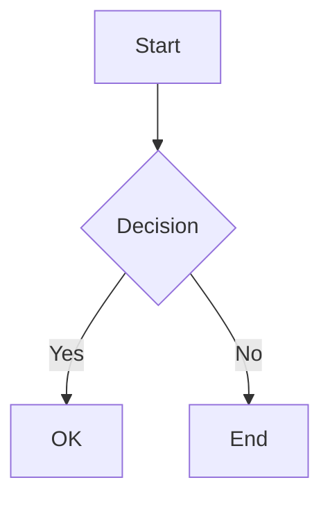

# Remar-stream | React Markdown Component for Streaming Content

[English](./README.md) | [中文](./README.zh-CN.md)

[](https://www.npmjs.com/package/remar-stream)
[](https://opensource.org/licenses/MIT)

A React Markdown renderer purpose-built for AI chat interfaces. Supports SSE streaming, KaTeX math formulas, and Mermaid diagrams. Features RAF-driven character animation for smooth, flicker-free streaming output.

## Features

- **Single-Tree Architecture** — Streaming and static modes share the same block rendering pipeline. Blocks naturally settle when streaming ends.
- **RAF + Direct DOM Animation** — `useStreamAnimator` drives character reveal via RAF, bypassing React's render cycle for 60fps smooth animation. No CSS `animation-delay` needed.
- **Block-Level Timeline** — `useBlockAnimation` manages per-block timeline refs with parallel animation start and dynamic speed-up for seamless multi-block transitions.
- **Smooth Streaming** — `useSmoothStreamContent` dynamically adjusts character output rate (CPS) and auto-closes incomplete Markdown syntax.
- **Math Formulas** — KaTeX rendering for inline (`$...$`) and block (`$$...$$`) with LRU cache. Inline formulas participate in character animation seamlessly.
- **Mermaid Diagrams** — Lazy-loaded Mermaid module (~500KB saved from main bundle), built-in zoom/download/fullscreen/source toolbar, SVG cache + debounce.
- **Code Highlighting** — Shiki with Web Worker for non-blocking syntax highlighting, custom `remar-light`/`remar-dark` themes, line-level memo, and language label + copy button on code blocks.
- **Plugin System** — Built-in `PluginRegistry` for extending Markdown element rendering with custom components.
- **TypeScript** — Full type definitions included.

## Installation

```bash
npm install remar-stream
# or
yarn add remar-stream
# or
pnpm add remar-stream
```

**Peer dependencies** (must be installed in your project):

```bash
npm install react@^18.0.0 react-dom@^18.0.0
# or React 19
npm install react@^19.0.0 react-dom@^19.0.0
```

## Quick Start

### Static Content

```tsx
import { RemarMarkdown } from 'remar-stream';

function App() {
  return <RemarMarkdown content="# Hello, remar-stream!" />;
}
```

### SSE Streaming

```tsx
import { useState } from 'react';
import { RemarMarkdown } from 'remar-stream';

function ChatMessage() {
  const [content, setContent] = useState('');
  const [isStreaming, setIsStreaming] = useState(false);

  const sendMessage = async (message: string) => {
    setIsStreaming(true);
    setContent('');

    const response = await fetch('/api/chat', {
      method: 'POST',
      body: JSON.stringify({ message }),
    });

    const reader = response.body?.getReader();
    const decoder = new TextDecoder();

    while (reader) {
      const { done, value } = await reader.read();
      if (done) break;
      setContent(prev => prev + decoder.decode(value));
    }

    setIsStreaming(false);
  };

  return <RemarMarkdown content={content} isStreaming={isStreaming} />;
}
```

### No Animation Mode

Skip all character and block animations for maximum performance:

```tsx
<RemarMarkdown
  content={content}
  isStreaming={isStreaming}
  disableAnimation
/>
```

### Dark Theme

Switch to dark mode via the `theme` prop. The component sets `data-theme="dark"` automatically:

```tsx
<RemarMarkdown content={content} theme="dark" />
```

### Built-in Plugin Features

Mermaid, math (KaTeX), code highlighting (Shiki), and table styling are all **auto-registered on first render** — no manual setup needed. Simply use them in your Markdown:

```markdown


$$E = mc^2$$

```python
print("Hello")
```
```

> For the full plugin system guide, see [docs/plugin-system.en.md](./docs/plugin-system.en.md)

## API

### `<RemarMarkdown>`

| Prop                 | Type                             | Default      | Description                                    |
| -------------------- | -------------------------------- | ------------ | ---------------------------------------------- |
| `content`            | `string`                         | **required** | Markdown content to render                     |
| `isStreaming`        | `boolean`                        | `false`      | Enable streaming optimization mode             |
| `className`          | `string`                         | —            | Additional CSS class for the container         |
| `theme`              | `'light' \| 'dark'`              | `'light'`    | Theme mode, applied via `data-theme` attribute |
| `disableAnimation`   | `boolean`                        | `false`      | Skip character fade-in, keep CPS buffering            |
| `viewportBlockRange` | `{ start: number; end: number }` | —            | Viewport block range for lazy rendering        |

## Supported Markdown Syntax

Based on `react-markdown` + `remark-gfm`. Supports standard CommonMark and GFM extensions including headings, bold, italic, lists, links, images, code blocks, blockquotes, horizontal rules, tables, and task lists.

**Math Formulas (KaTeX)**

```
Inline: $E = mc^2$

Block:
$$
\sum_{i=1}^{n} x_i = x_1 + x_2 + \cdots + x_n
$$
```

**Mermaid Diagrams**

````markdown

````

**Code Highlighting (Shiki)**

Powered by Shiki with Web Worker for non-blocking highlighting. Supports 200+ languages out of the box with custom `remar-light`/`remar-dark` themes.

## Styling

Remar uses a three-layer Design Token system (Seed → Map → Dark) with CSS variables for theming. Dark mode is supported out of the box.

> For the full theming guide, see [docs/theme.en.md](./docs/theme.en.md)

## Browser Support

- Chrome >= 80
- Firefox >= 75
- Safari >= 13.1
- Edge >= 80

## FAQ

**How does streaming animation work?**

Remar uses a two-layer animation system:

1. **Character-level**: `rehypeStreamAnimated` wraps text characters with `<span class="stream-char" data-ci="N">`. `useStreamAnimator` (RAF loop) reads per-block timeline refs and directly manipulates DOM className to reveal characters. This bypasses React's render cycle for smooth 60fps animation. A rehype inheritance mechanism prevents flicker when React rebuilds DOM during markdown structure changes.
2. **Block-level**: `useBlockAnimation` manages per-block timeline refs updated by RAF. All blocks start animation in parallel with timeline inheritance — subsequent blocks inherit timing from previous ones for seamless transitions. Dynamic speed-up ensures multi-block wave continuity.

`disableAnimation` skips the character fade-in animation — all characters appear instantly. CPS buffering still runs to control display rate and prevent frame drops. The same rendering pipeline is used (rehype marks `span.stream-char`, useStreamAnimator immediately reveals all chars).

**Does it work with Next.js?**

Yes. The build output includes a `"use client"` directive. Just import directly in App Router:

```tsx
import { RemarMarkdown } from 'remar-stream';
```

**Can I use it without streaming?**

Yes. Omit `isStreaming` or set it to `false` — Remar works as a standard static Markdown renderer with no animation overhead.

**Do I need to import CSS manually?**

Usually no. `dist/index.js` includes a CSS static reference that bundlers (Vite, Webpack, Next.js) handle automatically:

```tsx
import { RemarMarkdown } from 'remar-stream';
```

If styles don't load (non-standard bundler), import manually:

```tsx
import 'remar-stream/styles.css';
```

**Does it depend on any UI library?**

No. Peer dependencies are only `react` (^18.0.0 || ^19.0.0) and `react-dom`. Remar coexists with any UI framework (Ant Design, MUI, shadcn/ui, etc.). Styles use a `--remar-` prefixed CSS variable system with no global pollution.

**How to extend custom rendering?**

Use the plugin system to register custom component match rules, remark plugins, and language mappings. See [Plugin System Docs](./docs/plugin-system.en.md).

## Contributing

Contributions are welcome! Please submit an Issue or Pull Request on [GitHub](https://github.com/lumos-dev88/remar-stream).

## License

MIT © [remar](https://github.com/lumos-dev88/remar-stream)
