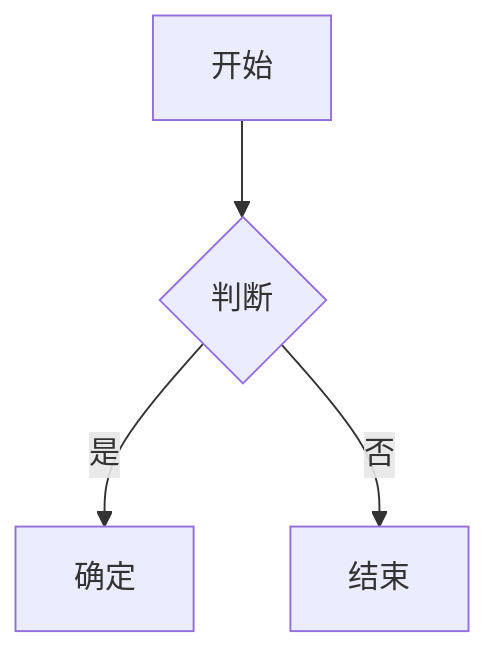

# Remar-stream · React 流式 Markdown 渲染组件

[English](./README.md) | [中文](./README.zh-CN.md)

[](https://www.npmjs.com/package/remar-stream)
[](https://opensource.org/licenses/MIT)

专为 AI 聊天界面设计的 React Markdown 流式渲染组件，原生支持 SSE 流式更新、KaTeX 数学公式与 Mermaid 图表。采用 RAF + Direct DOM 动画架构，实现流畅无闪烁的流式输出效果。

## 特性

- **单树架构** — 流式和静态使用同一套 block 渲染管线，流式结束时 block 自然 settled。
- **RAF + Direct DOM 动画** — `useStreamAnimator` 通过 RAF 驱动字符显示，直接操作 DOM className，绕过 React 渲染周期，实现 60fps 流畅动画。无需 CSS `animation-delay`。
- **块级时间线动画** — `useBlockAnimation` hook 管理每个 block 的独立 timeline ref，所有 block 并行启动动画，支持时间线继承和动态加速，实现多 block 无缝衔接。
- **流式内容平滑** — `useSmoothStreamContent` hook 动态调整字符输出速率（CPS），自动闭合不完整 Markdown 语法。
- **数学公式** — KaTeX 渲染，支持行内（`$...$`）和块级（`$$...$$`），LRU 缓存加速。行内公式无缝参与字符动画。
- **Mermaid 图表** — 懒加载 Mermaid 模块（主包减负约 500KB），内置缩放/下载/全屏/源码工具栏，SVG 缓存 + 防抖。
- **代码高亮** — Shiki + Web Worker 非阻塞语法高亮，自定义 `remar-light`/`remar-dark` 主题，行级 memo 优化，代码块显示语言标签和复制按钮。
- **插件系统** — 内置 `PluginRegistry` 注册中心，支持扩展自定义 Markdown 元素渲染。
- **TypeScript** — 完整类型定义，开箱即用。

## 安装

```bash
npm install remar-stream
# 或
yarn add remar-stream
# 或
pnpm add remar-stream
```

**Peer dependencies**（需在项目中安装）：

```bash
npm install react@^18.0.0 react-dom@^18.0.0
# 或 React 19
npm install react@^19.0.0 react-dom@^19.0.0
```

## 快速上手

### 静态内容

```tsx
import { RemarMarkdown } from 'remar-stream';

function App() {
  return <RemarMarkdown content="# Hello, remar!" />;
}
```

### SSE 流式场景

```tsx
import { useState } from 'react';
import { RemarMarkdown } from 'remar-stream';

function ChatMessage() {
  const [content, setContent] = useState('');
  const [isStreaming, setIsStreaming] = useState(false);

  const sendMessage = async (message: string) => {
    setIsStreaming(true);
    setContent('');

    const response = await fetch('/api/chat', {
      method: 'POST',
      body: JSON.stringify({ message }),
    });

    const reader = response.body?.getReader();
    const decoder = new TextDecoder();

    while (reader) {
      const { done, value } = await reader.read();
      if (done) break;
      setContent(prev => prev + decoder.decode(value));
    }

    setIsStreaming(false);
  };

  return <RemarMarkdown content={content} isStreaming={isStreaming} />;
}
```

### 无动画模式

不需要动画时（配合外部滚动、追求极致性能），传入 `disableAnimation` 跳过所有字符/块级动画：

```tsx
<RemarMarkdown
  content={content}
  isStreaming={isStreaming}
  disableAnimation
/>
```

### 暗色主题

通过 `theme` prop 切换暗色模式，组件自动设置 `data-theme="dark"` 属性：

```tsx
<RemarMarkdown content={content} theme="dark" />
```

### 自定义 Mermaid 渲染

通过插件系统自定义 Mermaid 渲染行为（主题、缓存等）：

```tsx
import { getRegistry, mermaidPlugin } from 'remar-stream';

const registry = getRegistry();
await registry.register(mermaidPlugin({ theme: 'dark', cacheMaxSize: 100 }));
```

> 完整插件系统文档请参阅 [docs/plugin-system.zh-CN.md](./docs/plugin-system.zh-CN.md)

## API

### `<RemarMarkdown>`

| Prop                 | 类型                               | 默认值       | 说明                        |
| -------------------- | ---------------------------------- | ------------ | --------------------------- |
| `content`            | `string`                           | **必填**     | Markdown 字符串             |
| `isStreaming`        | `boolean`                          | `false`      | 启用流式优化模式             |
| `className`          | `string`                           | —            | 附加到容器的 CSS 类名        |
| `theme`              | `'light' \| 'dark'`                | `'light'`    | 主题模式，通过 `data-theme` 属性切换 |
| `disableAnimation`   | `boolean`                          | `false`      | 跳过所有动画以优化性能       |
| `viewportBlockRange` | `{ start: number; end: number }`   | —            | 视口 block 范围，用于懒渲染  |

## 支持的 Markdown 语法

基于 `react-markdown` + `remark-gfm`，支持标准 CommonMark 和 GFM 扩展语法，包括标题、粗体、斜体、列表、链接、图片、代码块、引用、分隔线、表格、任务列表。

**数学公式（KaTeX）**

```
行内：$E = mc^2$

块级：
$$
\sum_{i=1}^{n} x_i = x_1 + x_2 + \cdots + x_n
$$
```

**Mermaid 图表**

````markdown

````

**代码高亮（Shiki）**

基于 Shiki 引擎，通过 Web Worker 实现非阻塞语法高亮，支持 200+ 种语言，内置自定义 `remar-light`/`remar-dark` 主题。

## 主题定制

remar 的样式基于三层 Design Token 体系（Seed → Map → Dark），支持通过 CSS 变量自定义外观，暗色模式开箱即用。

> 完整主题定制文档请参阅 [docs/theme.zh-CN.md](./docs/theme.zh-CN.md)

## 常见问题

**流式输出时动画效果是怎样的？**

remar 使用两层动画系统：

1. **字符级**：`rehypeStreamAnimated` 插件为文本字符包裹 `<span class="stream-char" data-ci="N">`。`useStreamAnimator`（RAF 循环）读取每个 block 的 timeline ref，直接操作 DOM className 来显示字符。这绕过了 React 渲染周期，实现流畅的 60fps 动画。rehype 继承机制在 Markdown 结构变化导致 DOM 重建时防止闪烁。
2. **块级**：`useBlockAnimation` hook 管理每个 block 的独立 timeline ref，由 RAF 更新。所有 block 并行启动动画，后续 block 通过时间线继承前一个 block 的时序实现无缝衔接，动态加速确保多 block 波浪连续性。

`disableAnimation` 模式下会跳过所有动画，block 直接以 settled 状态渲染。

**支持 Next.js 吗？**

支持。remar 的构建产物已内置 `"use client"` 指令，无需手动添加。在 App Router 中直接导入即可：

```tsx
import { RemarMarkdown } from 'remar-stream';
```

**不使用流式场景时可以用吗？**

可以。省略 `isStreaming` prop 或设为 `false`，remar 即作为普通静态 Markdown 渲染器使用，无动画开销。

**需要手动引入 CSS 吗？**

通常不需要。`dist/index.js` 顶部包含 CSS 静态引用，Vite / Webpack / Next.js 等构建工具会自动处理。只需正常导入组件即可：

```tsx
import { RemarMarkdown } from 'remar-stream';
```

如果样式未生效（非标准打包环境），可手动引入：

```tsx
import 'remar-stream/styles.css';
```

**依赖了哪些 UI 组件库？**

不依赖任何 UI 组件库。remar 的 peer dependencies 只有 `react`（^18.0.0 || ^19.0.0）和 `react-dom`，可以与 Ant Design、MUI、Arco Design、shadcn/ui 等任何 UI 框架共存。样式基于 CSS 变量体系，通过 `--remar-` 前缀隔离，不会污染全局样式。

**如何扩展自定义渲染？**

remar 提供插件系统，支持注册自定义组件匹配规则、remark 插件、语言映射等。详见 [插件系统文档](./docs/plugin-system.zh-CN.md)。

## 参与贡献

欢迎提交 Issue 和 Pull Request。

## 开源协议

MIT © [remar](https://github.com/lumos-dev88/remar-stream)
